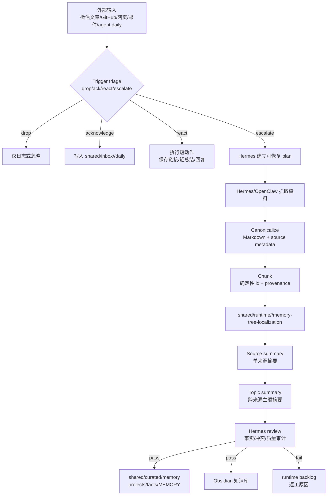

# OpenHuman 机制本地化：自我学习与升级系统

## 中心判断

OpenHuman 的价值不在于桌面 AI 助手本体，而在于它提供了一套适合“自我学习与升级”的机制闭环：外部输入持续进入、先进入可追溯原始层、再被分块/摘要/主题化、最后进入可被 agent 检索与人类审阅的长期知识层。

本项目目标是把这套机制本地化到现有 Hermes / OpenClaw / shared hub v2 / Obsidian 工作流中，并保持：

- 不依赖 OpenHuman 后端。
- 不复用 GPL 源码。
- 不把 runtime/cache/sqlite 写入 curated。
- 所有自动晋升都必须可追溯、可审计、可回滚。

## 目标系统边界

| 层 | 角色 |
|---|---|
| Hermes | 总控：路由、计划、审计、质量裁决、最终汇报 |
| OpenClaw | 执行/学习 agent：抓取、初步总结、候选产物生成 |
| shared hub v2 | 跨 agent 真相源与运行状态分层 |
| Obsidian 知识库 | 人类可读、可改、可复盘的长期学习库 |
| future agent | 未来接入时读取 shared 规则与项目状态 |

## 总体流程



## 状态流转

```text
RAW_INPUT
  -> TRIAGED_DROP | TRIAGED_ACK | TRIAGED_REACT | TRIAGED_ESCALATE
  -> FETCHED
  -> CANONICALIZED
  -> CHUNKED
  -> SOURCE_SUMMARIZED
  -> TOPIC_SUMMARIZED
  -> REVIEW_PENDING
  -> REVIEW_PASSED | REVIEW_FAILED
  -> CURATED_PROMOTED | OBSIDIAN_WRITTEN | BACKLOGGED
```

## POC 路线

### POC A：Memory Tree for shared/Obsidian

目标：不依赖 OpenHuman 代码，实现最小 Memory Tree。

输入样本：
- 微信文章 Markdown。
- GitHub README/issues。
- shared inbox/hermes 与 inbox/openclaw daily。

产物：
- runtime chunks：`runtime/hermes/memory-tree-localization/chunks/`
- source summaries：`runtime/hermes/memory-tree-localization/source-summaries/`
- topic summaries：`runtime/hermes/memory-tree-localization/topic-summaries/`
- Obsidian 实验文档：`/mnt/d/system/selfSystem/03-学习/技术实践/OpenHuman 调研档案/`

验收：
- 任一 topic summary 可追溯到 source URL/source file/quote。
- runtime 中间产物不进入 curated。
- 通过 Hermes review 后，才写 curated project/fact。

### POC B：Trigger triage

目标：对微信消息、文章链接、GitHub 事件先分类，避免所有输入都升级成长任务。

分类：
- `drop`：噪音/无需处理。
- `acknowledge`：只写 inbox 或短回复。
- `react`：一次短动作，不能启动长链路。
- `escalate`：建立 plan，必要时派 OpenClaw/Claude Code。

验收：
- 回放至少 20 条历史输入。
- 人工审阅准确率达到 80% 以上。
- `escalate` 必须生成可恢复 plan 与状态文件。

### POC C：Token compression rules

目标：借鉴 TokenJuice 思想，自研进入模型前的轻量压缩规则。

优先对象：
- 微信 HTML。
- GitHub README。
- Hermes/OpenClaw 日志。
- shared daily 长文。

验收：
- token/字符量下降。
- 关键信息保持率可由 Hermes review 抽查。
- 规则是 MIT/自研，不使用 OpenHuman GPL 源码。

### POC D：agentmemory bridge

目标：验证 agentmemory 是否能作为 shared Markdown 真相源之上的检索层。

原则：
- shared curated 仍是真相源。
- agentmemory 只做检索/召回加速。
- 删除、冲突、secret 策略必须先设计，不自动写入长期层。

## 当前状态

- 2026-05-17：完成 OpenHuman 调研与二轮复核。
- 2026-05-17：用户确认该机制符合自我学习与升级需求。
- 2026-05-17：本项目进入 planned 状态，下一步应先设计并执行 POC A/B，不直接安装或接入 OpenHuman 本体。

## 下一步

1. 先落地 runtime 计划与状态文件。
2. 生成 POC A/B 的执行模板。
3. 由 Hermes 总控，优先让执行 agent 产出样本和候选摘要。
4. Hermes 审计通过后，再决定是否晋升 shared skill 或 shared project 的 active 状态。

## 风险边界

- 禁止明文 secret 进入 shared。
- 禁止把 OpenHuman GPL 源码复制进 Hermes/OpenClaw。
- 禁止未经 review 的自动摘要写入 curated。
- 禁止把 runtime sqlite/cache/chunks 当作长期真相源。
